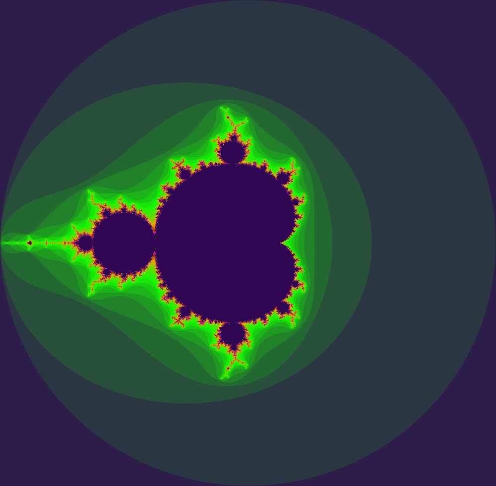
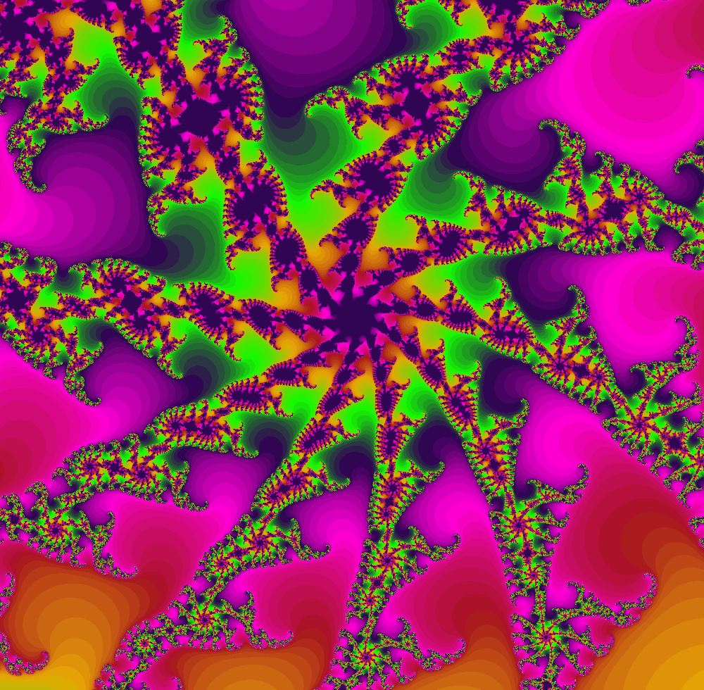
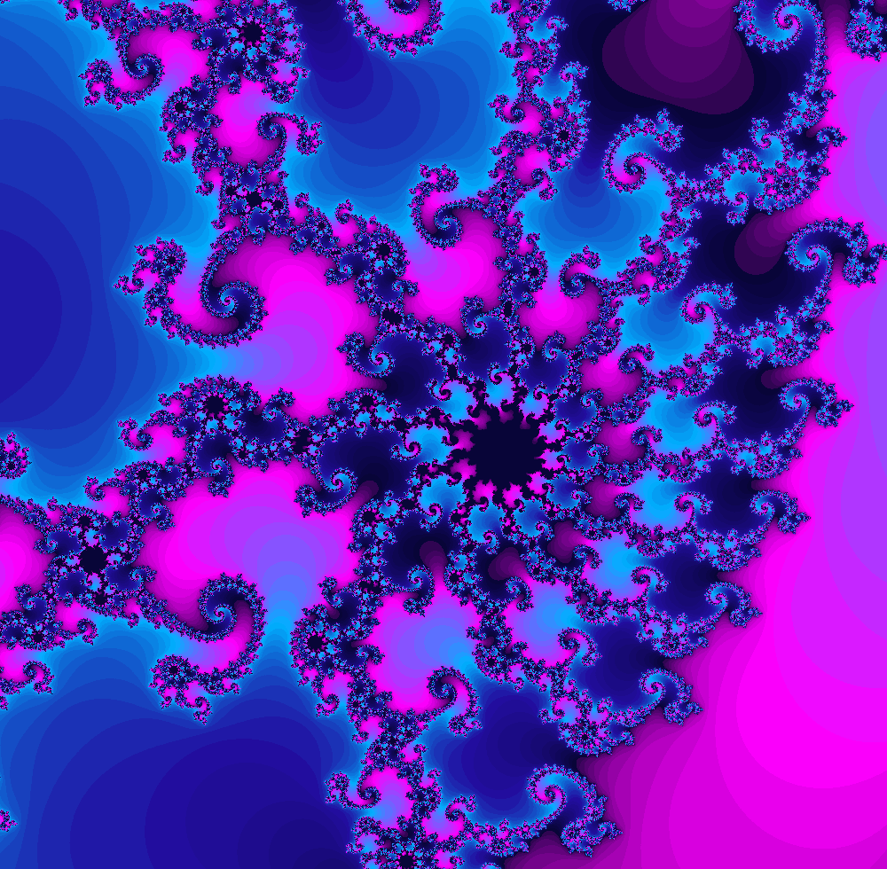
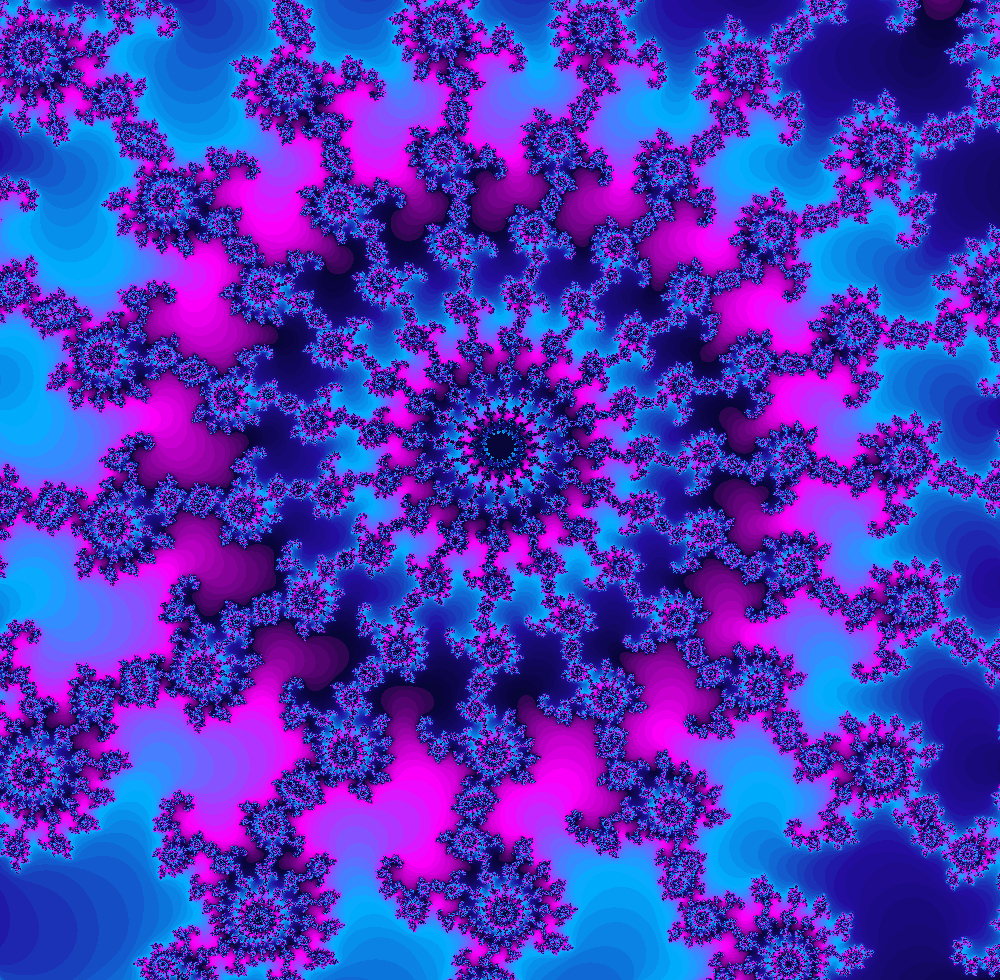

# Fractal Studio

## Features
1. GUI using PyQT5
2. Fractal displays (Mandelbrot/Julia currently) calculated using PyTorch tensors to leverage CUDA cores for improved speed.
3. Adjust the type of fractal, zoom depth, zoom factor, cetner, fractal power, and color map on-the-fly.
4. Click-to-center and scroll-to-zoom interactivity.
5. Integer and Fractional Escape Depth Calculations
6. Custom Color Maps for both integer and fractional sets.
7. Zoom-to functionality: zooms from default to current center and zoom factor.
8. Save Image with center, zoom, type, and map metadata.
9. Save zoom videos and various coloring animations.

## TODO
- [x] Adjust fractal implementation such that each FractalWidget is self contained.
- [ ] Add ability to switch from mandelbrot to julia and vice versa.
- [ ] Add an entry box for c in the julia set and fix backend so when julia is generated c=center
- [ ] Fix save image location, and figure out method for metadata collection for each image
- [ ] Add linear panning functionality across all changeable variables (power, depth, center, julia c, and zoom factors)
- [ ] Add smooth/fractional escape capabilities
- [ ] Add settings file that default values and things like discrete/smooth coloring, resolution, etc can be loaded from on startup.
- [ ] Improve visual look of the configuration/options panel.

## Examples

